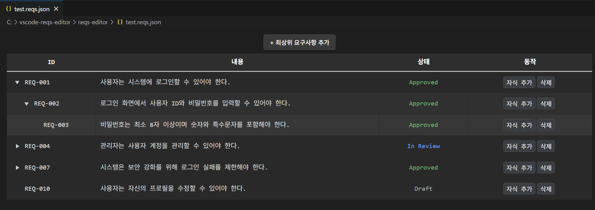

# Requirements Editor (VS Code Extension)


요구사항(.reqs.json) 파일을 계층형 테이블로 시각화하고,
직관적으로 편집할 수 있는 VS Code 확장 프로그램입니다.
React 기반의 Webview UI와 VS Code API를 결합하여,
요구사항 관리 과정을 간편하고 일관되게 만들어 줍니다.
<br><br>

## 실행화면



<br>

## 주요 특징
- 계층 깊이에 따른 들여쓰기 및 명암변화로 구조 시각화<br>
- ID 자동 부여 및 중복 방지<br>
- VS Code 다크 테마와 자연스럽게 어울리는 UI <br>
- 실시간 편집 및 파일 자동 저장


<br>

## 설치 및 실행 방법 

1.  reqs-editor-[version].vsix 파일을 다운로드합니다. 

2. VSCode에서 Ctrl + Shift + P 를 누릅니다.

3. "Extensions: Install from VSIX" 를 입력/선택합니다.

4. 다운로드한 .vsix 파일을 선택하면 설치가 진행됩니다. 

5. .reqs.json 확장자를 가진 파일을 열면, 자동으로 본 확장의 Webview가 표시됩니다.

<br>

## 아키텍처와 핵심 로직 

React 기반 Webview에서 사용자가 데이터를 편집하면
`postMessage()`를 통해 Extension Host로 변경 사항이 전달되며,
Host 측에서는 Node.js의 `fs` 모듈을 이용하여 원본 JSON 파일을 즉시 갱신합니다.

반대로 파일이 열릴 때에는, Extension Host가 파일 내용을 읽어
초기 데이터를 Webview로 전달하고, Webview는 이를 상태(`useState`)로 관리하여 렌더링합니다.

이러한 양방향 구조를 통해 사용자는 VS Code 내부에서
별도의 파일 편집 없이 직관적인 UI 기반 요구사항 관리를 수행할 수 있습니다.

<br>


### 아키텍처 개요

| 구성 요소 | 설명 |
|------------|------|
| **extension.js** | VSCode API 진입점. Webview 생성 및 React HTML 로드 |
| **ReqsEditorProvider.js** | Custom Editor Provider. init/update 메시지 처리 |
| **React Webview (my-react-app)** | 사용자 UI 렌더링, 계층 테이블 구현 |
| **useWebviewMessaging Hook** | VSCode ↔ React 간 메시지 통신 관리 |
| **useRequirements Hook** | 요구사항 CRUD 및 상태 관리 로직 |

<br>

### React Webview와 EXtension Host 통신 흐름

1. **Webview 로드 시**  
   `useEffect()` 내부에서 Extension Host로 준비 완료 메시지를 전송합니다.   
```js
vscode.postMessage({ type: "ready" })` 
```

<br>

2.  **Host가 ready 메시지 수신 후**  
현재 열려 있는 요구사항 파일(.reqs.json)을 읽고, 초기 데이터를 Webview로 전달합니다.     

```js
webview.postMessage({ type: "init", data })
```

<br>

3. **사용자 편집 시**  
React가 변경된 요구사항 데이터를 전송합니다. 
```js 
vscode.postMessage({ type: "update-requirements", payload });
```

<br>

4. **Host가 업데이트 메시지 수신 후**   
`fs.writeFile()`로 실제 파일을 업데이트합니다.

<br>

### 기술 스택

- VS Code API
- React 18 & Vite
- JavaScript 
- Node.js